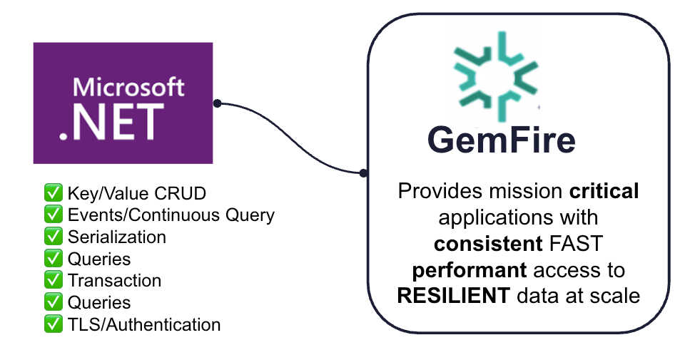
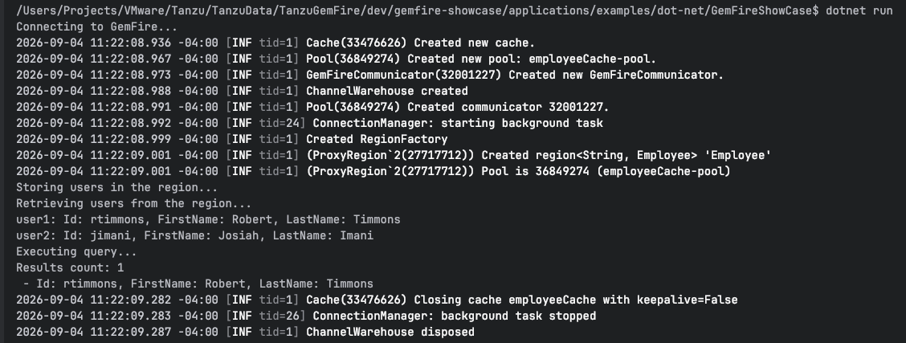
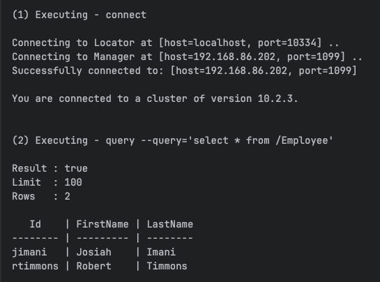

# GemFire .NET Client 

GemFire now provides mission critical .NET applications with consistent FAST performant access to RESILIENT data at scale.

## Quickstart

This guide demonstrates how to set up a .NET console application, start a local GemFire cluster, and execute basic CRUD and OQL query operations using the GemFire .NET Native Client.



## Prerequisites & Installation

Install the .NET SDK
If you have Homebrew installed on macOS, run:

```shell
brew install --cask dotnet-sdk
```
See [GemFire DotNET client Quickstart](https://gemfire.dev/ja/quickstart/dotnet)


# C# Example Application

Example Program.cs with the following code. It defines a PDXSerializable model class and connects to the cluster to perform put, get, and query operations.


```C#
using System;
using GemFire.Client;

namespace GemFireExample
{
    public class Employee : IPdxSerializable
    {
        public string Id { get; set; } = string.Empty;
        public string FirstName { get; set; } = string.Empty;
        public string LastName { get; set; } = string.Empty;

        // Constructor for PDX deserialization factory
        public static IPdxSerializable CreateDeserializable() => new Employee();

        public void FromData(IPdxReader reader)
        {
            Id = reader.ReadString("Id") ?? string.Empty;
            FirstName = reader.ReadString("FirstName") ?? string.Empty;
            LastName = reader.ReadString("LastName") ?? string.Empty;
        }

        public void ToData(IPdxWriter writer)
        {
            writer.WriteString("Id", Id);
            writer.WriteString("FirstName", FirstName);
            writer.WriteString("LastName", LastName);
        }

        public override string ToString()
        {
            return $"Id: {Id}, FirstName: {FirstName}, LastName: {LastName}";
        }
    }

    internal class Program
    {
        private static void Main(string[] args)
        {
            Console.WriteLine("Connecting to GemFire...");

            // Use 'using' statement to ensure cache resources close cleanly even if an exception occurs
            using var cache = new CacheFactory()
                .AddLocator("127.0.0.1", 10334)
                .Create("employeeCache");

            // Register PDX type directly using the static factory method on Employee
            cache.TypeRegistry.RegisterPdxType(Employee.CreateDeserializable);

            // Create region using string key and Employee value
            var regionFactory = cache.CreateRegionFactory(RegionShortcut.PROXY);
            var region = regionFactory.Create<string, Employee>("Employee");

            Console.WriteLine("Storing users in the region...");

            // Use object initializers for clean object setup
            var emp1 = new Employee { Id = "rtimmons", FirstName = "Robert", LastName = "Timmons" };
            var emp2 = new Employee { Id = "jimani", FirstName = "Josiah", LastName = "Imani" };
            

            region.Put(emp1.Id, emp1);
            region.Put(emp2.Id, emp2);

            Console.WriteLine("Retrieving users from the region...");
            var user1 = region.Get(emp1.Id);
            var user2 = region.Get(emp2.Id);

            Console.WriteLine($"user1: {user1}\nuser2: {user2}");

            Console.WriteLine("Executing query...");
            var queryService = cache.GetQueryService();
            
            // OQL string comparison check
            var query = queryService.NewQuery<Employee>(
                "SELECT * FROM /Employee WHERE FirstName > 'Josiah'"
            );

            var results = query.Execute();

            Console.WriteLine($"Results count: {results.Count}");
            foreach (var emp in results)
            {
                Console.WriteLine($" - {emp}");
            }
        }
    }
}
```


# Cluster Setup & Execution

1. Start the GemFire Cluster
   Run the provided startup script to spin up local locator and server instances:

```shell
./deployment/local/gemfire/start.sh
```

2. Create the Region
   Use gfsh to create a partitioned region named Employee:

```shell
$GEMFIRE_HOME/bin/gfsh -e "connect" -e "create region --name=Employee --type=PARTITION"
```

3. Run the Application

```shell
cd applications/examples/dot-net/GemFireShowCase
dotnet run
```

Example Results




Query Results




-----------------------------

# Creating a New Application (Reference)

```shell
cd applications/examples/dot-net
dotnet new console -n GemFireShowCase
cd GemFireShowCase
```

```shell
dotnet add reference GemFire.Client.dll
dotnet add package Serilog --version 4.3.0
dotnet add package Serilog.Enrichers.Thread --version 4.0.0
dotnet add package Serilog.Sinks.Console --version 6.1.1
dotnet add package DotNetty.Transport --version 0.7.6
dotnet add package Microsoft.Extensions.Configuration.Abstractions --version 9.0.0
dotnet add package Microsoft.Extensions.Configuration --version 9.0.0
dotnet add package DotNetty.Handlers --version 0.7.6
```