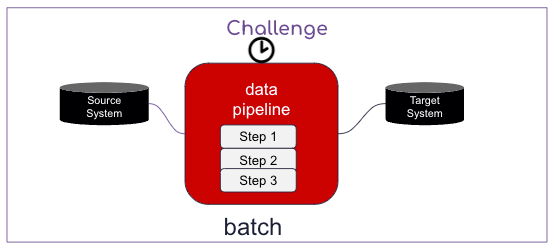
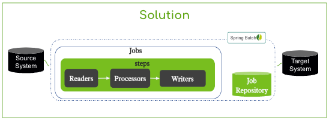
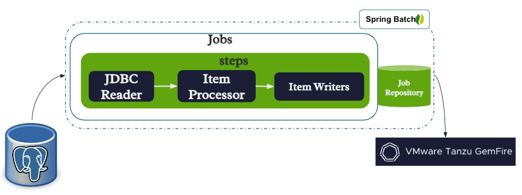

# Batching Design Pattern

## Problem

- Complexity with implemented a multiple-steps batch from a source to target system
- Hard to implement bulk read/process/write data loads
- Multi-threading/parallel processing performance challenges
- Data quality issues such as mismatches in records between source and target
- Challenges with reporting execution status of failure or success



## Solution/Benefits 



- Spring Batch provides  comprehensive framework to simplify to the implementation of any batch process
- Spring Batch easily scales to multi-threading
- Supports parallel batch processing and chunk based processing
- Well documented and proven framework to data quality usings well known concepts
- Provides job repository observations to quick determines the status of steps in a job execution


# Account Web Batch

Example solution




-----------------

# Job Repository Reporting

View Jobs in Database


```sql
select ji.job_instance_id , je.*  
from boot3_batch_job_execution je, boot3_batch_job_instance ji
where je.job_instance_id = ji.job_instance_id 
order by ji.job_instance_id desc
```

# Testing SQL(s)

```sql
select * from taccounts.accounts;
 drop table taccounts.accounts;
```