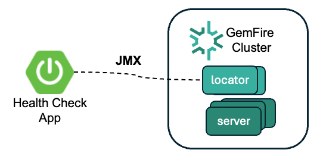

# gemfire-health-check

This is a reference implementation of a Health-check/repair GemFire app.
The application uses Spring Boot. It uses JMX to communicate with a GemFire locator.




This solution performs various health checks and performs safe rebalance of data only when there is a specified number of the members.
The health checks are executed on a schedule.

This reference application provides the following operations
- Check if a server has unbalance buckets based on having a member with no buckets [See AreBucketsUnBalanced.java](src/main/java/showcase/gemfire/health/check/AreBucketsUnBalanced.java)
- Check if there is no buckets without redundancy  [See HasServerCountThreshold.java](src/main/java/showcase/gemfire/health/check/HasServerCountThreshold.java)
- Check if a GemFire server's memory are unbalance based on a given threshold.  [See IsAverageMemberUsedMemoryAboveThreshold.java](src/main/java/showcase/gemfire/health/check/IsAverageMemberUsedMemoryAboveThreshold.java)


Note: The application has automated rebalance safety conventions to maintain a healthier state for the cluster.
For example, it will not execute a rebalance if the cluster does not have a majority of members.
- See [HasServerCountThreshold.java](src/main/java/showcase/gemfire/health/check/HasServerCountThreshold.java)


# Get Started

Running the health check application

```shell
java -jar applications/gemfire-health-check/build/libs/gemfire-health-check-0.0.1-SNAPSHOT.jar --gemfire.jmx.locator.url="service:jmx:rmi:///jndi/rmi://localhost:1099/jmxrmi" --gemfire.rebalance.threshold.server.count=3 --gemfire.check.schedule.cron="0 * * * * *" --gemfire.security.username=admin --gemfire.security.password=admin
```


Argument/Properties


| Property                                                 | Notes                                                                                                                                                   | Default     |
|----------------------------------------------------------|---------------------------------------------------------------------------------------------------------------------------------------------------------|-------------|
| gemfire.jmx.locator.url                                  | JMX connection URL of the GemFire locator                                                                                                               |             | 
| gemfire.security.username                                | GemFire security user name if security manager is implemented                                                                                           |
| gemfire.security.password                                | GemFire security password if security manager is implemented                                                                                            |
| gemfire.rebalance.threshold.server.count                 | The minimum number of cache server members required before executing a rebalance                                                                        |             |
| gemfire.check.threshold.member.memory.used.above.average | Triggers a rebalance repair when the memory for a member is above the average by this percentage. Tune this as needed based on observed memory patterns | 50          |
| gemfire.check.schedule.cron                              | See [Spring Cron Express](https://docs.spring.io/spring-framework/reference/integration/scheduling.html#scheduling-cron-expression)                     | 0 * * * * * |


# Testing

Use script to start a multi server cluster

```shell
deployment/local/gemfire/start-multi-servers.sh
```

Create region

```shell
$GEMFIRE_HOME/bin/gfsh -e "connect" -e "create region --name=test --type=PARTITION"
```


Stop 1 server

```shell
$GEMFIRE_HOME/bin/gfsh -e "connect" -e "stop server --name=server1"
```


*Loading Data*

Use Performance Test application to put data into the test region


Test region with data

```shell
java -Xmx1g -Xms1g -jar -Daction=putAllString applications/gemfire-perf-test/build/libs/gemfire-perf-test-0.0.3.jar  --regionName=test  --threadCount=10  --threadSleepMs=0  --loopCount=10000 --batchSize=10000 --keyPadLength=10 --valueLength=500 --seedText=T1  --server.port=0
```


Start

Start Server 1

```shell
cd $GEMFIRE_HOME/bin
$GEMFIRE_HOME/bin/gfsh -e "start server --name=server1 --max-heap=500m --initial-heap=500m --locators=localhost[10334] --server-port=1880 --J=-Dgemfire.prometheus.metrics.emission=Default --J=-Dgemfire.prometheus.metrics.port=7778 --J=-Dgemfire.prometheus.metrics.host=localhost --J=-Dgemfire.prometheus.metrics.interval=15s --bind-address=127.0.0.1  --http-service-port=8590" 
```