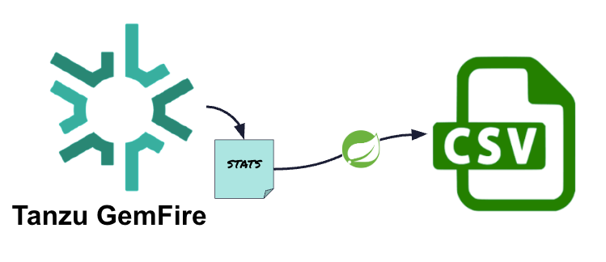

# GemFire Stats To CSV

This application prints useful [GemFire](https://gemfire.dev/) statistics to a CSV file.

This application only prints the [Most useful statistics](https://community.broadcom.com/education/blogs/migration-user/2021/07/01/the-most-useful-statistics-for-troubleshooting-vmware-gemfire-deployments) for troubleshooting  GemFire Deployments.



## Getting Started

This application has been tested with the following

- Java 17
- Gradle 8.4


| Property          | Notes                                                                                                                      |
|-------------------|----------------------------------------------------------------------------------------------------------------------------|
| csv.output.file   | The path of the output CSV file                                                                                            |
| stats.input.path  | The input directory containing the GemFire statistic files. Note the application searches for nested stats in sub-folders. |
| -stats.day.filter | Allow print stats that match the provide day filter to the CSV file. Date Format is MM/dd/yyyy.                            |


**Download application**

Click to download [gemfire-stats-to-csv-1.0.0.jar](https://github.com/ggreen/gemfire-showcase/releases/download/gemfire-stats-to-csv-1.0.0/gemfire-stats-to-csv-1.0.0.jar)

Downloading using a script

```shell
mkdir -p runtime/
curl -L "https://github.com/ggreen/gemfire-showcase/releases/download/gemfire-stats-to-csv-1.0.0/gemfire-stats-to-csv-1.0.0.jar" -o runtime/$(basename hhttps://github.com/ggreen/listener-showcase/releases/download/listener-stats-to-csv-1.0.0/listener-stats-to-csv-1.0.0.jar)

```

Example run downloaded Jar


```shell
java -jar runtime/listener-stats-to-csv-1.0.0.jar --csv.output.file=/tmp/gf.csv --stats.input.path=$PWD --stats.day.filter=6/23/2025
```

Or run built version

```shell
java -jar applications/operations/listener-stats-to-csv/build/libs/listener-stats-to-csv-1.0.0.jar --csv.output.file=/tmp/gf.csv --stats.input.path=$PWD --stats.day.filter=6/23/2025
```


Example CSV output


 | machine           | typeName               | resourceInstName                                 | descriptionName          | min                | avg                  | max                | description                                                                                                   | units        |
 |-------------------|------------------------|--------------------------------------------------|--------------------------|--------------------|----------------------|--------------------|---------------------------------------------------------------------------------------------------------------|--------------|
 | aarch64 localhost | DistributionStats      | distributionStats                                | nodes                    | 1.0                | 1.0                  | 1.0                | The current number of nodes in this distributed system.                                                       | nodes        |
 | aarch64 localhost | DistributionStats      | distributionStats                                | functionExecutionThreads | 1.0                | 1.9892857142857143   | 2.0                | The current number of threads dedicated to processing function execution messages. These threads may be idle. | threads      |
 | aarch64 localhost | DistributionStats      | distributionStats                                | highPriorityThreads      | 2.0                | 2.0                  | 2.0                | The current number of threads dedicated to processing high priority messages. These threads may be idle.      | threads      |
 | aarch64 localhost | DistributionStats      | distributionStats                                | partitionedRegionThreads | 1.0                | 1.0                  | 1.0                | The current number of threads dedicated to processing partitioned region messages. These threads may be idle. | threads      |
 | aarch64 localhost | StatSampler            | statSampler                                      | delayDuration            | 0.0                | 993.95               | 1007.0             | Actual duration of sampling delay taken before taking this sample.                                            | milliseconds |
 | aarch64 localhost | VMStats                | vmStats                                          | fdsOpen                  | 137.0              | 292.75714285714287   | 403.0              | Current number of open file descriptors                                                                       | fds          |
 | aarch64 localhost | VMStats                | vmStats                                          | fdLimit                  | 10240.0            | 10240.0              | 10240.0            | Maximum number of file descriptors                                                                            | fds          |
 | aarch64 localhost | VMStats                | vmStats                                          | processCpuTime           | 1228315.0548354937 | 6.591670058663403E7  | 5.67279780876494E9 | CPU timed used by the process in nanoseconds.                                                                 | nanoseconds  |
 | aarch64 localhost | VMStats                | vmStats                                          | threads                  | 46.0               | 82.88571428571429    | 95.0               | Current number of live threads (both daemon and non-daemon) in this VM.                                       | threads      |
 | aarch64 localhost | VMMemoryPoolStats      | CodeHeap 'non-nmethods'-Non-heap memory          | currentUsedMemory        | 1463168.0          | 1656280.2285714287   | 1672192.0          | The estimated amount of used memory currently in use for this pool, measured in bytes.                        | bytes        |
 | aarch64 localhost | VMMemoryPoolStats      | CodeHeap 'non-nmethods'-Non-heap memory          | currentMaxMemory         | 5849088.0          | 5849088.0            | 5849088.0          | The maximum amount of memory this pool can have in bytes.                                                     | bytes        |
 | aarch64 localhost | VMMemoryPoolStats      | Metaspace-Non-heap memory                        | currentUsedMemory        | 3.6543288E7        | 1.015031244E8        | 1.03368408E8       | The estimated amount of used memory currently in use for this pool, measured in bytes.                        | bytes        |
 | aarch64 localhost | VMMemoryPoolStats      | Metaspace-Non-heap memory                        | currentMaxMemory         | -1.0               | -1.0                 | -1.0               | The maximum amount of memory this pool can have in bytes.                                                     | bytes        |
 | aarch64 localhost | VMMemoryPoolStats      | ZHeap-Heap memory                                | currentUsedMemory        | 9.6468992E7        | 8.348088027428571E8  | 8.57735168E8       | The estimated amount of used memory currently in use for this pool, measured in bytes.                        | bytes        |
 | aarch64 localhost | VMMemoryPoolStats      | ZHeap-Heap memory                                | currentMaxMemory         | 1.7179869184E10    | 1.7179869184E10      | 1.7179869184E10    | The maximum amount of memory this pool can have in bytes.                                                     | bytes        |
 | aarch64 localhost | VMMemoryPoolStats      | CodeHeap 'profiled nmethods'-Non-heap memory     | currentUsedMemory        | 6175360.0          | 2.0225583085714284E7 | 2.1673088E7        | The estimated amount of used memory currently in use for this pool, measured in bytes.                        | bytes        |
 | aarch64 localhost | VMMemoryPoolStats      | CodeHeap 'profiled nmethods'-Non-heap memory     | currentMaxMemory         | 1.22896384E8       | 1.22896384E8         | 1.22896384E8       | The maximum amount of memory this pool can have in bytes.                                                     | bytes        |
 | aarch64 localhost | VMMemoryPoolStats      | Compressed Class Space-Non-heap memory           | currentUsedMemory        | 4408360.0          | 1.2152175742857143E7 | 1.23278E7          | The estimated amount of used memory currently in use for this pool, measured in bytes.                        | bytes        |
 | aarch64 localhost | VMMemoryPoolStats      | Compressed Class Space-Non-heap memory           | currentMaxMemory         | 1.073741824E9      | 1.073741824E9        | 1.073741824E9      | The maximum amount of memory this pool can have in bytes.                                                     | bytes        |
 | aarch64 localhost | VMMemoryPoolStats      | CodeHeap 'non-profiled nmethods'-Non-heap memory | currentUsedMemory        | 1286656.0          | 6740899.657142857    | 7108864.0          | The estimated amount of used memory currently in use for this pool, measured in bytes.                        | bytes        |
 | aarch64 localhost | VMMemoryPoolStats      | CodeHeap 'non-profiled nmethods'-Non-heap memory | currentMaxMemory         | 1.22912768E8       | 1.22912768E8         | 1.22912768E8       | The maximum amount of memory this pool can have in bytes.                                                     | bytes        |
 | aarch64 localhost | CacheServerStats       | localhost-localhost/127.0.0.1:2882               | currentClients           | 0.0                | 0.4874551971326165   | 1.0                | Number of client virtual machines connected.                                                                  | clients      |
 | aarch64 localhost | CacheServerStats       | localhost-localhost/127.0.0.1:2882               | currentClientConnections | 0.0                | 0.8853046594982079   | 2.0                | Number of sockets accepted and used for client to server messaging.                                           | sockets      |
 | aarch64 localhost | PartitionedRegionStats | /UserAccount                                     | bucketCount              | 0.0                | 0.44047619047619047  | 1.0                | Number of buckets in this node.                                                                               | buckets      |
 | aarch64 localhost | PartitionedRegionStats | /UserAccount                                     | primaryBucketCount       | 0.0                | 0.44047619047619047  | 1.0                | Current number of primary buckets hosted locally.                                                             | buckets      |
 | aarch64 localhost | PartitionedRegionStats | /UserAccount                                     | dataStoreBytesInUse      | 0.0                | 81.92857142857143    | 186.0              | The current number of bytes stored in this Cache for the named Partitioned Region                             | bytes        |


