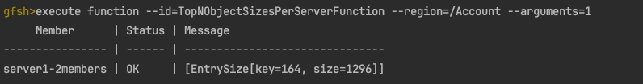

# gemfire-object-sizing-function

This function allows you determine the top entries bytes sizes in
region data. This is importance to determine why data may be unbalanced
in GemFire due large entries such as objects with nested collections , maps, 
etc.

Note this function uses the GemFire ReflectionObjectSizer of the 
[ObjectSizer](https://developer.broadcom.com/xapis/vmware-gemfire-java-api-reference/latest/org/apache/geode/cache/util/ObjectSizer.html).

This  implementation is the most accurate ObjectSizer calculator.

This function has been tested with the following

- GemFire version 10.1.0 
- Java 17
- Gradle 8.4


## Getting Started 

You must deploy the function using the gfsh deploy command.


Example:

```shell
$GEMFIRE_HOME/bin/gfsh -e "connect" -e "deploy --jar=$PWD/components/functions/gemfire-object-sizing-function/build/libs/gemfire-object-sizing-function-1.0.0-SNAPSHOT.jar"
```

The function can executed on a GemFire region
The following is an example of how to execute the function on the given a region in Gfsh.

Inputs

| Input     | Notes                                                      |
|-----------|------------------------------------------------------------| 
| id        | TopNByteSizesPerServerFunction                             |
| region    | name of the region to execute                              |
| arguments | The top N number of the entries to return per cache server |

```shell
execute function --id=TopNByteSizesPerServerFunction --region=$REGION --arguments=$TopNNumberOfEntries
```

Get Top 3 entry by byte sizes per data node cache server in a cluster 

```shell
execute function --id=TopNByteSizesPerServerFunction --region=/TestObjectSizes --arguments=3
```




## Build Jar


To build the function, set GemFire Maven Repository user credentials as environment variables.
See https://gemfire.dev/quickstart/java/

Example

```shell
export BROADCOM_MAVEN_USERNAME=$HARBOR_USER
export BROADCOM_GEMFIRE_MAVEN_PASSWORD=$HARBOR_PASSWORD
```

Change directory to components from the root project directory

```shell
cd components/functions/gemfire-object-sizing-function
```

Perform a Grade build

```shell
gradle build 
```

-------------------
# Testing Function

## Start GemFire

```shell
cd $GEMFIRE_HOME/bin
```

Start Gfsh

```shell
./gfsh
```

Start Locator in Gfsh
```shell
start locator --name=locator
```

Configure Pdx
```shell
configure pdx --read-serialized=true --disk-store
```

Start Cache Server in gfsh
```shell
start server --name=server1 --locators=localhost[10334]
```


Create a region in gfsh

```shell
create region --name=TestObjectSizes --type=PARTITION
```

Add data

```shell
put --key=1 --value="Hello 00000000A" --region=/TestObjectSizes
put --key=2 --value="Hello 0000000000000000A" --region=/TestObjectSizes
put --key=3 --value="Hello 000000000000000000000000AAA" --region=/TestObjectSizes
put --key=hello1 --value=hello1 --region=/TestObjectSizes
put --key=hello2 --value=hello2 --region=/TestObjectSizes
put --key=hello3 --value=hello3 --region=/TestObjectSizes
```

Get data 
```shell
get --key=1 --region=/TestObjectSizes
get --key=2 --region=/TestObjectSizes
```

The following is an example of how to execute the function on the given a region in Gfsh.

Get Top # 
```shell
execute function --id=TopNByteSizesPerServerFunction --region=/TestObjectSizes --arguments=3
```


Create a region in gfsh

```shell
create region --name=TestObjectSizesReplicated --type=REPLICATE
```

Add data

```shell
put --key=1 --value="Hello 00000000A" --region=/TestObjectSizesReplicated
put --key=2 --value="Hello 0000000000000000A" --region=/TestObjectSizesReplicated
put --key=3 --value="Hello 000000000000000000000000AAA" --region=/TestObjectSizesReplicated
put --key=hello1 --value=hello1 --region=/TestObjectSizesReplicated
put --key=hello2 --value=hello2 --region=/TestObjectSizesReplicated
put --key=hello3 --value=hello3 --region=/TestObjectSizesReplicated
```


Get Top #
```shell
execute function --id=TopNByteSizesPerServerFunction --region=/TestObjectSizesReplicated --arguments=3
```