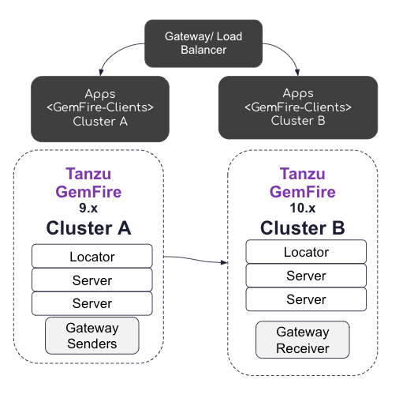

# GemFire Zero Down Time Upgrade
## Blue Green - Backup/restore

The following documentation a GemFire Upgrade using 
a Blue Green deployment with WAN Replications

High Level Steps

- Deploy GemFire Cluster B with regions and GemFire [Gateway Receiver](https://docs.vmware.com/en/VMware-GemFire/10.1/gf/topologies_and_comm-multi_site_configuration-setting_up_a_multisite_system.html)
- Configure Cluster A regions/Gateway Senders (see details to updating [without](https://docs.vmware.com/en/VMware-GemFire/10.1/gf/topologies_and_comm-multi_site_configuration-setting_up_a_multisite_system.html) the cluster configuration service)
  - Use dedicated parallel sender for partitioned regions
  - Serial used for replicated regions or maintaining order of event processing
- Backup Cluster A -> Restore -> Cluster B
  - ONLY restore server diskstore
  - DO NOT restore cluster 1 locator cluster configurations
- Deploy Apps <GemFire-Clients> to Cluster B
- Use Gateway or Load Balance to redirect App traffic from Cluster A to Cluster B
- Shutdown Apps <GemFire-Clients> to Cluster A
- Shutdown Cluster A after a successful migration


---------------------

# Local Demo Instructions

Goto project root
Example
```shell
cd /Users/Projects/VMware/Tanzu/TanzuData/TanzuGemFire/dev/gemfire-showcase
```

Start Blue Cluster (cluster 1)
```shell
source deployment/upgrades/blue-setenv.sh
./deployment/upgrades/blue_start.sh
```


Create Region in blue cluster 

```shell
$GEMFIRE_BLUE_HOME/bin/gfsh -e "connect --locator=localhost[10001]" -e "create region --name=accounts --type=PARTITION_REDUNDANT_PERSISTENT"
```

Add data

```shell
$GEMFIRE_BLUE_HOME/bin/gfsh -e "connect --locator=localhost[10001]" -e "put --region=/accounts --key=1 --value="account-1""
```
-------------------------------------

## Start Green Cluster

In Gfsh (new Terminal Shell)

```shell
source deployment/upgrades/green-setenv.sh
```

```shell
./deployment/upgrades/green_start.sh
```

Gateway Receiver

```shell
$GEMFIRE_GREEN_HOME/bin/gfsh -e "connect --locator=localhost[10002]" -e "create gateway-receiver --start-port=7520 --end-port=7521"
```

Verify

```shell
$GEMFIRE_GREEN_HOME/bin/gfsh -e "connect --locator=localhost[10002]" -e "list members"
```

Create Region

```shell
$GEMFIRE_GREEN_HOME/bin/gfsh -e "connect --locator=localhost[10002]" -e "create region --name=accounts --type=PARTITION_REDUNDANT_PERSISTENT"
```

--------------------

Add Gateway to Blue Cluster


## Create Gateway receiver to cluster 1

Create Gateway Sender
```shell
$GEMFIRE_BLUE_HOME/bin/gfsh -e "connect --locator=[10001]" -e "create gateway-sender --id=cluster2 --parallel=true --remote-distributed-system-id=2 --enable-persistence=true"
```

Add Data
```shell
$GEMFIRE_BLUE_HOME/bin/gfsh -e "connect --locator=localhost[10001]" -e "put --region=/accounts --key=1 --value="account-1-A""
```

Add Gateway Sender to Region

```shell
$GEMFIRE_BLUE_HOME/bin/gfsh -e "connect --locator=[10001]" -e "alter region --name=/accounts  --gateway-sender-id=cluster2"
```

Update Data

```shell
$GEMFIRE_BLUE_HOME/bin/gfsh -e "connect --locator=localhost[10001]" -e "put --region=/accounts --key=1 --value="account-1-B""
```

Stop Blue Cluster Locator

```shell
$GEMFIRE_BLUE_HOME/bin/gfsh -e "connect --locator=[10001]" -e "stop locator --name=gf1-locator"
```

Start BLUE Locator with remote locators to Green Cluster
```shell
cd $GF_DIR/gf-cluster/blue
$GEMFIRE_BLUE_HOME/bin/gfsh -e "start locator --name=gf1-locator --J=-Dgemfire.remote-locators=127.0.0.1[10002] --enable-cluster-configuration=true --connect=false --port=10001  --J=-Dgemfire.jmx-manager-port=1099 --max-heap=250m --initial-heap=250m --bind-address=127.0.0.1 --hostname-for-clients=127.0.0.1  --jmx-manager-hostname-for-clients=127.0.0.1 --http-service-bind-address=127.0.0.1"
```


Restart  Green Cluster Gateway Receiver
```shell
$GEMFIRE_GREEN_HOME/bin/gfsh -e "connect --locator=localhost[10002]"  -e "stop gateway-receiver"
$GEMFIRE_GREEN_HOME/bin/gfsh -e "connect --locator=localhost[10002]"  -e "start gateway-receiver"
```

Restart Blue Cluster Gateway Sender
```shell
$GEMFIRE_BLUE_HOME/bin/gfsh -e "connect --locator=localhost[10001]" -e "stop gateway-sender --id=cluster2"
$GEMFIRE_BLUE_HOME/bin/gfsh -e "connect --locator=localhost[10001]" -e "start gateway-sender --id=cluster2"
```

Verify Connected Sender (restart receivers and senders as needed)

```shell
$GEMFIRE_GREEN_HOME/bin/gfsh -e "connect --locator=localhost[10002]"  -e "list gateways"
```


## Backup Blue Cluster

Backup Blue Cluster

```shell
mkdir -p $GF_DIR/gf-cluster/blue/backup
$GEMFIRE_BLUE_HOME/bin/gfsh -e "connect --locator=localhost[10001]" -e "backup disk-store --dir=$GF_DIR/gf-cluster/blue/backup"
```


Shutdown Green Cluster

```shell
$GEMFIRE_GREEN_HOME/bin/gfsh -e "connect --locator=localhost[10002]" -e "shutdown --include-locators=true"
```


Blue Cluster -> Edit restore.sh to copy disk stores to green cluster
```shell
vi $GF_DIR/gf-cluster/blue/backup/*/*/restore.sh
```
Example restore.sh

```
# Restore data
rm -rf '/Users/devtools/repositories/IMDG/gemfire/runtime/zero-downtime-upgrade/gf-cluster/green/gf1-server/'
mkdir -p '/Users/devtools/repositories/IMDG/gemfire/runtime/zero-downtime-upgrade/gf-cluster/green/gf1-server/.'
cp -rp 'diskstores/DEFAULT_95216c211a9444a5-8c10326d5c720b26/dir0'/* '/Users/devtools/repositories/IMDG/gemfire/runtime/zero-downtime-upgrade/gf-cluster/green/gf1-server/.'
```


Run modified restores.sh on ONLY the servers

```shell
cd backup/*/*gf1_server*/
./restore.sh
```


```shell
cd ../*gf2_server*/
./restore.sh
```

-----

Restart Cluster Green

Start Locator
```shell
cd $GF_DIR/gf-cluster/green
$GEMFIRE_GREEN_HOME/bin/gfsh -e "start locator --name=gf1-locator --J=-Dgemfire.distributed-system-id=2   --J=-Dgemfire.remote-locators=127.0.0.1[10001] --enable-cluster-configuration=true --connect=false  --http-service-port=0 --J=-Dgemfire.tcp-port=11111 --port=10002 --J=-Dgemfire.jmx-manager-port=1098 --max-heap=250m --initial-heap=250m --bind-address=127.0.0.1 --hostname-for-clients=127.0.0.1  --jmx-manager-hostname-for-clients=127.0.0.1 --http-service-bind-address=127.0.0.1"
```


Start Green Cluster Server 1
```shell
cd $GF_DIR/gf-cluster/green
$GEMFIRE_GREEN_HOME/bin/gfsh -e "start server --name=gf1-server  --J=-Dgemfire.distributed-system-id=2   --use-cluster-configuration=true --server-port=10201   --locators=127.0.0.1[10002] --max-heap=1g   --initial-heap=1g  --bind-address=127.0.0.1 --hostname-for-clients=127.0.0.1  --jmx-manager-hostname-for-clients=127.0.0.1 --http-service-bind-address=127.0.0.1" &
```

Start Green Cluster Server 2
```shell
cd $GF_DIR/gf-cluster/green
$GEMFIRE_GREEN_HOME/bin/gfsh -e "start server --name=gf2-server  --J=-Dgemfire.distributed-system-id=2   --use-cluster-configuration=true --server-port=10202   --locators=127.0.0.1[10002] --max-heap=1g   --initial-heap=1g  --bind-address=127.0.0.1 --hostname-for-clients=127.0.0.1  --jmx-manager-hostname-for-clients=127.0.0.1 --http-service-bind-address=127.0.0.1"
```

------------------------------------------
# WAN Replication - Parallel - Testing


Verify --value="account-1-B"

```shell
$GEMFIRE_GREEN_HOME/bin/gfsh -e "connect --locator=localhost[10001]" -e "get --region=/accounts --key=1"
```

Update Value

```shell
$GEMFIRE_BLUE_HOME/bin/gfsh -e "connect --locator=localhost[10001]" -e "put --region=/accounts --key=1 --value="account-1-C""
```

Verify value=account-1-C

```shell
$GEMFIRE_GREEN_HOME/bin/gfsh -e "connect --locator=localhost[10001]" -e "get --region=/accounts --key=1"
```

