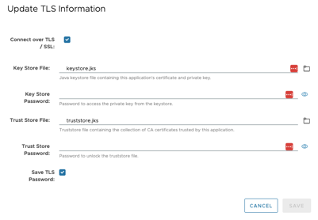

# GemFire with TLS certificates

This page documents how [TLS](https://docs.vmware.com/en/VMware-GemFire/10.0/gf/managing-security-ssl_example.html) is configured in a [GemFire cluster](https://tanzu.vmware.com/gemfire) and [GemFire Management Console](https://docs.vmware.com/en/VMware-GemFire-Management-Console/1.0/gfmc/index.html).

Also see scripts in [GitHub repo here](https://github.com/ggreen/gemfire-extensions/tree/main/deployments/scripts/gemfire-devOps-bash)


## Generate Self Signed Certificates

Generate client keystore
```shell
$JAVA_HOME/bin/keytool -genkey -alias gemfire -keyalg RSA -keypass $CERT_PASSWORD -storepass $CERT_PASSWORD -validity $CERT_VALIDITY_DAYS -alias gemfire -dname "CN=${MEMBER_FULL_HOST_NM}" -keysize 2048  -keystore $SECURITY_DIR/keystore.jks
```


Export Key Store
```shell
$JAVA_HOME/bin/keytool -export -alias gemfire -storepass $CERT_PASSWORD -file $SECURITY_DIR/gemfire.cer -keystore $SECURITY_DIR/keystore.jks
```

Import Certs (generates trust store certificate)

```shell
$JAVA_HOME/bin/keytool  -noprompt -import -v -trustcacerts -alias gemfire -file $SECURITY_DIR/gemfire.cer -keystore $SECURITY_DIR/truststore.jks -keypass $CERT_PASSWORD -storepass $CERT_PASSWORD
```

## GemFire Security Properties

Create gfsecurity.properties


```yaml
ssl-keystore=<PATH>/keystore.jks
ssl-keystore-password=<PASSWORD>
ssl-truststore=<PATH>/truststore.jks
ssl-ciphers=TLS_RSA_WITH_AES_128_GCM_SHA256
ssl-require-authentication=true
ssl-protocols=TLSv1.2
ssl-keystore-type=jks
ssl-truststore-password=<PASSWORD>
ssl-enabled-components=all
ssl-truststore-type=jks
```

Change Permissions on certificate files

```shell
chmod 600 $SECURITY_DIR/*.keystore
chmod 600 $SECURITY_DIR/*.jks
```


## Start GemFire Cluster


start locator providing argument 
**--security-properties-file=$SECURITY_DIR/gfsecurity.properties**


Example Gfsh Start Locator Command

```shell
start locator --name=<hostname>_locator --bind-address=<hostname> --J=-Djava.rmi.server.hostname=<hostname> --hostname-for-clients=<hostname> --J=-Dgemfire.jmx-manager-hostname-for-clients=<hostname>  --locators=<hostname>[10000] --port=10000 --dir=<proj-dir>/runtime/work/locator --log-level=config --initial-heap=200m --max-heap=200m --connect=false --J=-Dgemfire.jmx-manager-port=11099 --J=-Dgemfire.jmx-manager-start=true  --J=-Dgemfire.enable-time-statistics=false --J=-Dgemfire.remote-locators= --J=-Dgemfire.distributed-system-id=1  --J=-Dgemfire.conserve-sockets=false --J=-Dgemfire.tcp-port=10001 --J=-Dgemfire.membership-port-range=10901-10910   --enable-cluster-configuration=true --cluster-config-dir=<proj-dir>/runtime/work/locator/cluster_config --http-service-port=17070  --J=-Xlog:gc --J=-Xlog:safepoint --J=-Xlog:gc* --J=-Xlog:task*=debug  --security-properties-file=******** --J=-Dgemfire.log-disk-space-limit=5 --J=-Dgemfire.log-file-size-limit=1  --classpath=<gemfire-home>/tools/Modules/gemfire-prometheus-metrics/*:<proj-dir>/lib/* --J=-Dgemfire.security-manager=io.pivotal.dataTx.geode.security.UserSecurityManager --J=-Dgemfire.security-username=***** --J=-Dgemfire.security-password=********  --J=-Dconfig.properties=/Users/Projects/VMware/Tanzu/TanzuData/TanzuGemFire/dev/gemfire-extensions/deployments/scripts/gemfire-devOps-bash/config/users.properties --J=-Dgemfire.statistic-archive-file=locator_<hostname>.gfs  --J=-D-gemfire.statistic-sampling-enabled=true --J=-Dgemfire.archive-disk-space-limit=5 --J=-Dgemfire.archive-file-size-limit=5 --J=-Dlog4j.configurationFile=/Users/Projects/VMware/Tanzu/TanzuData/TanzuGemFire/dev/gemfire-extensions/deployments/scripts/gemfire-devOps-bash/config/log4j2.xml --J=-Dgemfire.prometheus.metrics.port=17001
```

start server providing argument
**--security-properties-file=$SECURITY_DIR/gfsecurity.properties**

Example Gfsh Start Server Command

```shell
start server --name=<server-name> --locators=<-locator-hostname-name>[10000] --cache-xml-file= --initial-heap=500m --max-heap=500m --dir=<work-dir> --use-cluster-configuration=true --server-port=10100   --log-level=config --start-rest-api=true --J=-Dgemfire.conserve-sockets=false --J=-Dgemfire.max-connections=800 --J=-Dgemfire.tcp-port=10002 --statistic-archive-file=<hostname-name>_stat.gfd --J=-Dgemfire.Query.VERBOSE=true --J=-Dgemfire.QueryService.allowUntrustedMethodInvocation=true --J=-Dgemfire.membership-port-range=10801-10810 --hostname-for-clients=<hostname-name> --J=-Dgemfire.bind-address=<hostname-name> --J=-Dgemfire.http-service-bind-address=<hostname-name>  --J=-Dgemfire.enable-time-statistics=false --J=-Dgemfire.http-service-port=18080   --J=-Dgemfire.log-disk-space-limit=5 --J=-Dgemfire.log-file-size-limit=1 --disable-classloader-isolation=false  --classpath=<gemfire-home>/tools/Modules/gemfire-prometheus-metrics/*:<proj-dir>/lib/* --J=-Dgemfire.security-manager=io.pivotal.dataTx.geode.security.UserSecurityManager  --J=-Dconfig.properties=<proj-dir>/config/users.properties --user=****** --password=******** --J=-Dgemfire.statistic-archive-file=datanode_<hostname-name>.gfs   --J=-D-gemfire.statistic-sampling-enabled=true  --J=-Dgemfire.archive-disk-space-limit=5  --J=-Dgemfire.archive-file-size-limit=5   --J=-Dgemfire.mcast-port=0  --security-properties-file=********    --J=-Dgemfire.redundancy-zone=<hostname-name> --J=-Dgemfire.prometheus.metrics.port=17011

```


## GemFire Management Console

Add *application.properties* in the directory used to start the console.

```properties
server.port=7077
server.ssl.enabled=true
server.ssl.key-store=file:<path>/keystore.jks
server.ssl.key-store-type=JKS
server.ssl.key-store-password=<PASSWORD>
#server.ssl.key-alias=gmc
```


Start the GemFire console

*You must have installed Java 17*

```shell
java --add-opens java.base/java.lang=ALL-UNNAMED --add-opens java.base/java.util=ALL-UNNAMED -jar vmware-gemfire-management-console-1.1.0.jar
```

Following steps to [creature cluster/update TLS](https://docs.vmware.com/en/VMware-GemFire-Management-Console/1.1/gfmc/clusters_dashboard.html#update_tls)

