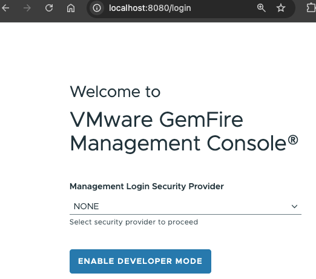
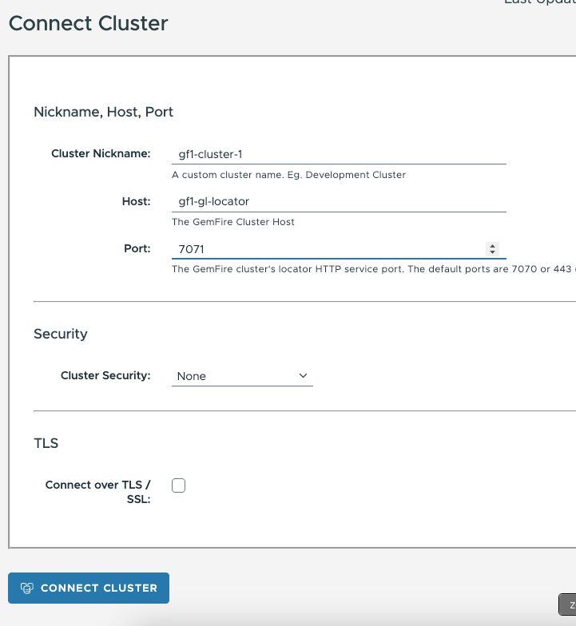
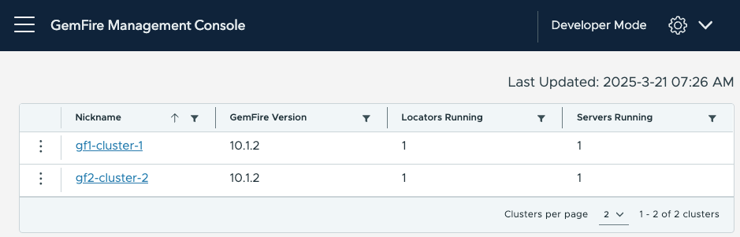
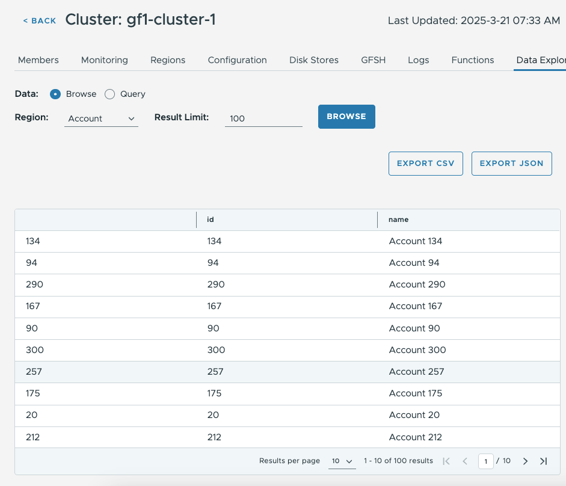
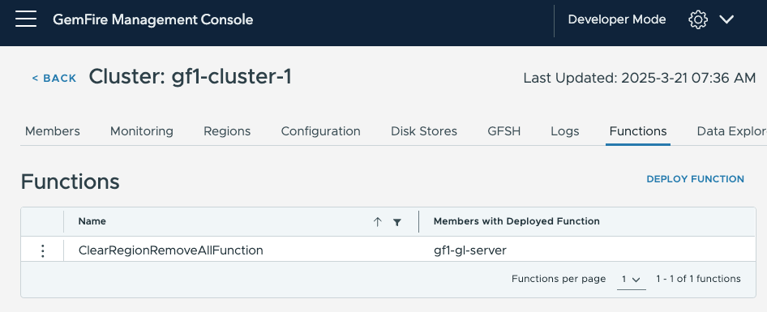
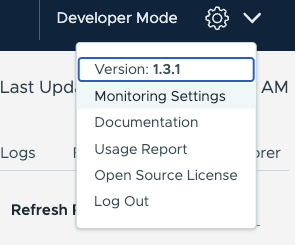

# Demo on GemFire management console


This demo will setup 2 WAN replication connected GemFire clusters.
The GemFire Manage Console will be used to showcase the fleet
management abilities.


*Required Components*

- Podman
- 

## Getting Started

Use the following script to start GemFire in docker

```shell
./deployment/scripts/gideon-console/podman/start-gemfire.sh
```

Use the following script to start the management console in Docker

```shell
./deployment/scripts/gideon-console/podman/start-gmc-console.sh
```


### Setup GemFire Management Console

Open GemFire Management Console

```shell
open http://localhost:8080
```

Click Enable Development Mode




#### Add GemFire Cluster 1

Click Connect 


The following

```properties
Nickname=gf1-cluster-1
Host=gf1-gl-locator
Port=7071
```




Click Add Another Cluster

Add Cluster 2


```properties
Nickname=gf2-cluster-2
Host=gf2-gl-locator
Port=7072
```

There should be 2 GemFire clusters




# Starting Demo


## Connect Spring GemFire client application

Start example Spring Application

```shell
podman run -it --rm --name account-service-gemfire-showcase --network=gemfire-cache  -p 8050:8050  cloudnativedata/account-service-gemfire-showcase:0.0.1-SNAPSHOT --spring.data.gemfire.pool.locators="gf1-gl-locator[10334]" --server.port=8050
```
Open application Swagger UI


```shell
open http://localhost:8050/swagger-ui/index.html
```

## Gfsh Commands

```shell
list members
```

```json
show metrics
```


```json
list clients
```

WAN replication


Topology

```shell
open http://localhost:8080/dashboard/multi-site/topology
```

World Map
```shell
open http://localhost:8080/dashboard/multi-site/world-map
```


### Load Data

Use the following bash script to write records into the Account region

```shell
for i in {1..300}
do
  accountJson='{ "id": "';
  accountJson+=$i;
  accountJson+='", "name": "Account ';
  accountJson+=$i;
  accountJson+='"}';

  curl -X 'POST' \
  'http://localhost:8050/accounts' \
  -H 'accept: */*' \
  -H 'Content-Type: application/json' \
  -d $accountJson
  echo;  
done
```

Get a single Record

```shell
curl -X 'GET' \
  'http://localhost:8050/accounts/1' \
  -H 'accept: */*'
```

View account data in the Data Explorer

Note: data is sync in both clusters




Example query 

```sql
select * from /Account where name like 'Account 1%'
```

## Deploy Jars

Deploy Function




----------------------------------
# Monitoring

Click Monitoring to get default views.


## Update Monitoring Settings

Click Settings -> Monitoring Settings



Select option "Use Embedded Prometheus Server (only available for OVA and OCI distributions)"


## Performance Testing

putString

```shell
podman run -it --rm  --name=gemfire-perf-test --network=gemfire-cache cloudnativedata/gemfire-perf-test:0.0.3 --action=putString --regionName=test  --threadCount=10  --threadSleepMs=0  --loopCount=5000 --startKeyValue=1 --endKeyValue=25000000 --batchSize=10 --valueSize=5 --spring.data.gemfire.pool.locators="gf1-gl-locator[10334]" --spring.data.gemfire.security.username=admin --spring.data.gemfire.security.password=admin --server.port=0
```


putAndGetAndQuery

```shell
podman run -it --rm  --name=gemfire-perf-test --network=gemfire-cache -e JAVA_OPTS=" -Xmx1g -Xms1g" cloudnativedata/gemfire-perf-test:0.0.3 --action=putAndGetAndQuery --regionName=test  --batchSize=10 --keyPadLength=10 --seedText=TEST --queryByKey="select key from /test.entries where key = \$1" --valueLength=500 --startKeyValue=1 --spring.data.gemfire.pool.locators="gf1-gl-locator[10334]" --spring.data.gemfire.security.username=admin --spring.data.gemfire.security.password=admin --server.port=0


```


Stress Testing (Will cause out of memory errors)

```shell
podman run -it --rm  --name=gemfire-perf-test --network=gemfire-cache -e JAVA_OPTS=" -Xmx1g -Xms1g" cloudnativedata/gemfire-perf-test:0.0.3-SNAPSHOT  --action=putAllString applications/gemfire-perf-test/build/libs/gemfire-perf-test-0.0.2-SNAPSHOT.jar  --regionName="test"  --threadCount=5  --threadSleepMs=1000  --loopCount=1000 --batchSize=100 --keyPadLength=10 --valueLength=500 --seedText=T1 --server.port=0
```


# Shutdown

```shell
podman rm -f gf1-gl-locator gf1-gl-server gf2-gl-locator gf2-gl-server gideon-console account-service-gemfire-showcase gemfire-perf-test
```

