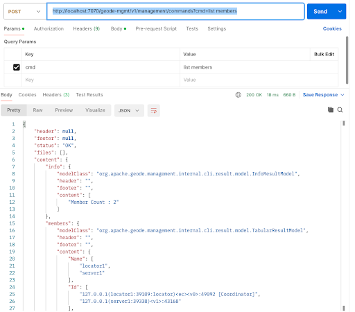

#  GemFire Gfsh Management API

The **geode-mgmt/v1/management** is API that can be enabled on the GemFire locator.
This API is currently used by the [GemFire Management Console](https://community.broadcom.com/education/blogs/john-martin/2024/10/10/gemfire-management-console-13-new-features-and-enhancements).

This API allows you to execute [Gfsh](https://gemfire.dev/tutorials/java/gem-fire-basics) commands using the HTTP endpoint.

The following is an example gfsh list members command

http://localhost:7070/geode-mgmt/v1/management/commands?cmd=list members





## Getting Started

The following is an example script to enable the management API on the GemFire locator.

```shell
$GEMFIRE_HOME/bin/gfsh -e "start locator --name=locator1 --port=10334 --J=-Dgemfire.prometheus.metrics.emission=Default --J=-Dgemfire.prometheus.metrics.port=7777 --J=-Dgemfire.prometheus.metrics.host=localhost --J=-Dgemfire.prometheus.metrics.interval=15s --bind-address=127.0.0.1 --J=-Dgemfire.enable-management-rest-service=true --J=-Dgemfire.enable-cluster-configuration=true  --J=-Dgemfire.start-rest-api=true"
```


# Gfsh Commands


The following are examples to execute common gfsh commands using the HTTP API endpoint.

| Command                  | Example Curl                                                                                                                                 |
|--------------------------|----------------------------------------------------------------------------------------------------------------------------------------------|
| list members             | curl --request POST --data 'cmd=list members' http://localhost:7070/geode-mgmt/v1/management/commands                                        |
| create region            | curl --request POST --data 'cmd=create region --name=FROM_REST_API --type=PARTITION' http://localhost:7070/geode-mgmt/v1/management/commands |
| list regions             | curl --request POST --data 'cmd=list regions' http://localhost:7070/geode-mgmt/v1/management/commands                                        |
| list gateways            | curl --request POST --data 'cmd=list gateways' http://localhost:7070/geode-mgmt/v1/management/commands                                       |
| list clients             | curl --request POST --data 'cmd=list clients' http://localhost:7070/geode-mgmt/v1/management/commands                                        |
| show missing-disk-stores | curl --request POST --data 'cmd=show missing-disk-stores' http://localhost:7070/geode-mgmt/v1/management/commands                            |
| describe region          | curl --request POST --data 'cmd=describe region --name=/test' http://localhost:7070/geode-mgmt/v1/management/commands                        |


