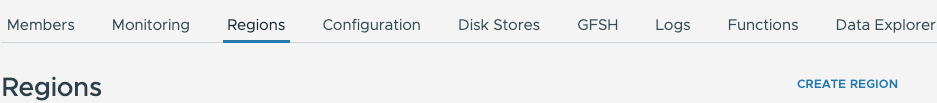

# Demo on GemFire management console


This demo will setup 2 WAN replication connected GemFire clusters.
The GemFire Manage Console will be used to showcase the fleet
management abilities.


*Required Components*

- Podman
- 

## Getting Started

Use the following script to start GemFire

```shell
deployment/scripts/podman/labs/start-gemfire-cluster.sh
```

Use the following script to start the management console in Docker

```shell
./deployment/scripts/podman/start-gmc-gideon-console.sh
```


### Setup GemFire Management Console

Open GemFire Management Console 

```shell
open http://localhost:8080
```

Click Enable Development Mode


#### Add GemFire Cluster 1

Click Connect 


The following

```properties
Nickname=gf1-cluster-1
Host=gf-locator
Port=7070
```


Create Region Using GMC

Click Regions -> CREATE Region



```properties
Region-Name=Account
Region-Type=PARTITION
```


# Starting Demo


## Connect Spring GemFire client application

Start example Spring Application

```shell
podman run -it --rm --name account-service-gemfire-showcase --network=gemfire-cache  -p 8050:8050  cloudnativedata/account-service-gemfire-showcase:0.0.1-SNAPSHOT --spring.data.gemfire.pool.locators="gf-locator[10334]" --server.port=8050
```
Open application Swagger UI


```shell
open http://localhost:8050
```

### Load Data

Use the following bash script to write records into the Account region

```shell
for i in {1..300} 
do
  accountJson='{ "id": "';
  accountJson+=$i;
  accountJson+='", "name": "Account ';
  accountJson+=$i;
  accountJson+='"}';

  curl -X 'POST' \
  'http://localhost:8050/accounts' \
  -H 'accept: */*' \
  -H 'Content-Type: application/json' \
  -d $accountJson
  echo;  
done
```

Get a single Record

```shell
curl -X 'GET' \
  'http://localhost:8050/accounts/1' \
  -H 'accept: */*'
```


Open GMC -> Data Explorer


- Select Account region
- Click Browse


Click Query

```sql
select * from /Account where name like 'Account 1%'
```


## Deploy Jars


Download function

```shell
mkdir -P runtime/functions
wget -P runtime/functions https://github.com/ggreen/gemfire-showcase/releases/download/gemfire-showcase-labs-001/gemfire-clear-region-function-1.0.1.jar
```
Deploy Function

Click Functions -> Deploy Function


Clear Region

- Click Execution


Select Regions -> Account


## Gfsh Commands

Click GFSH


Executed the following command

```shell
list clients
```
Enter return

Show metrics

```shell
show metrics
```


----------------------------------

# Monitoring

Click Monitoring to get default views.

## Create test region


Region

```properties
name=test
type=PARTITION
```


## Update Monitoring Settings


Click Settings -> Monitoring Settings


Select option "Use Embedded Prometheus Server (only available for OVA and OCI distributions)"


Click Monitoring

- Change scale ot 2 mins
- 


## Performance Testing

putString

```shell

podman run -it --rm  --name=gemfire-perf-test --network=gemfire-cache cloudnativedata/gemfire-perf-test:0.0.2-SNAPSHOT --action=putString --regionName=test  --threadCount=10  --threadSleepMs=0  --loopCount=1000000 --startKeyValue=1 --endKeyValue=25000000 --batchSize=10 --valueSize=5 --spring.data.gemfire.pool.locators="gf-locator[10334]" --spring.data.gemfire.security.username=admin --spring.data.gemfire.security.password=admin --server.port=0
```


putAndGetAndQuery

```shell
podman run -it --rm  --name=gemfire-perf-test --network=gemfire-cache -e JAVA_OPTS=" -Xmx1g -Xms1g" cloudnativedata/gemfire-perf-test:0.0.3-SNAPSHOT --action=putAndGetAndQuery --regionName=test  --batchSize=10 --keyPadLength=10 --seedText=TEST --queryByKey="select key from /test.entries where key = \$1" --valueLength=500 --startKeyValue=1 --spring.data.gemfire.pool.locators="gf-locator[10334]" --spring.data.gemfire.security.username=admin --spring.data.gemfire.security.password=admin --server.port=0
```


---

# Shutdown

```shell
podman rm -f gf-locator gf-server1 account-service-gemfire-showcase gmc-console
```

